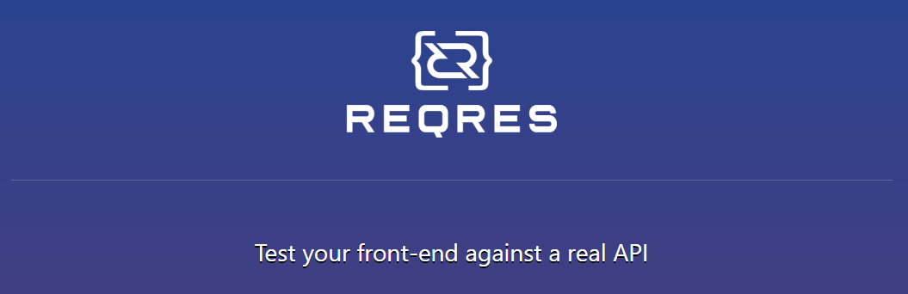
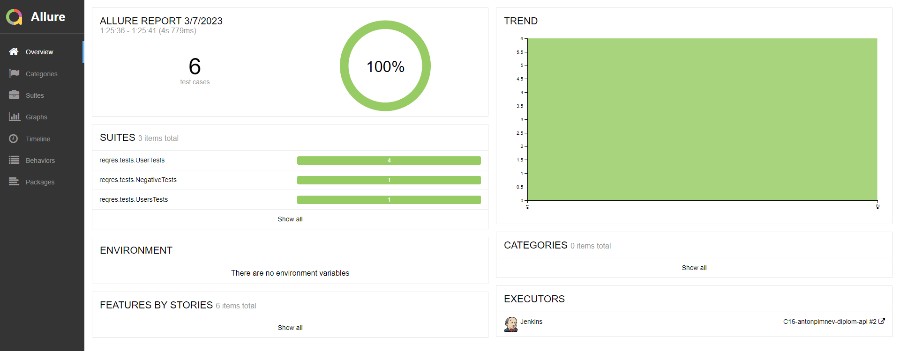
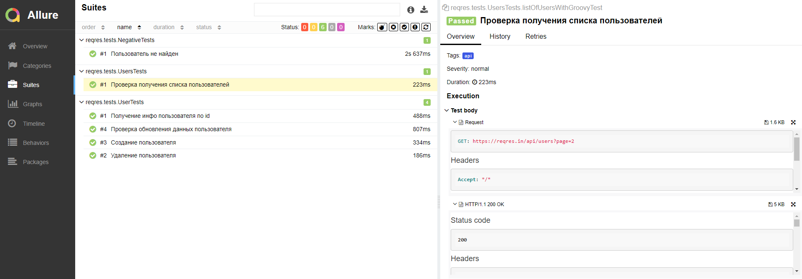
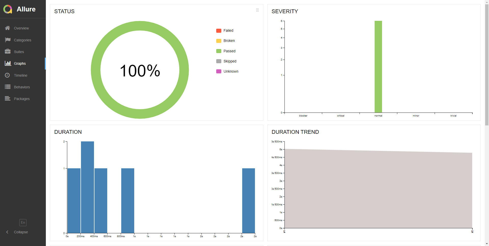
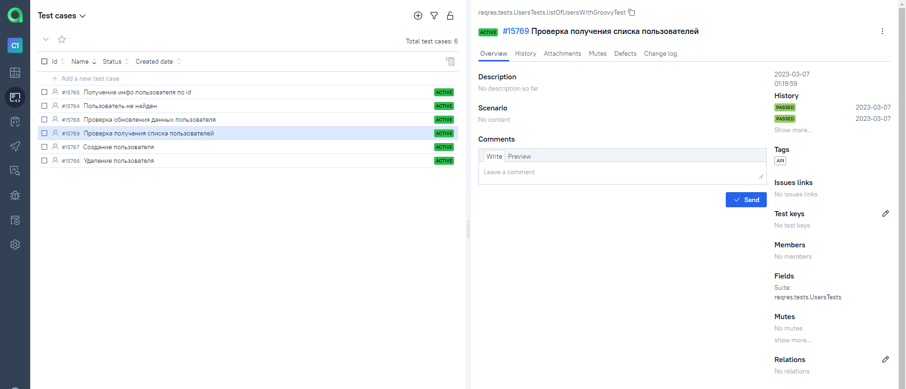
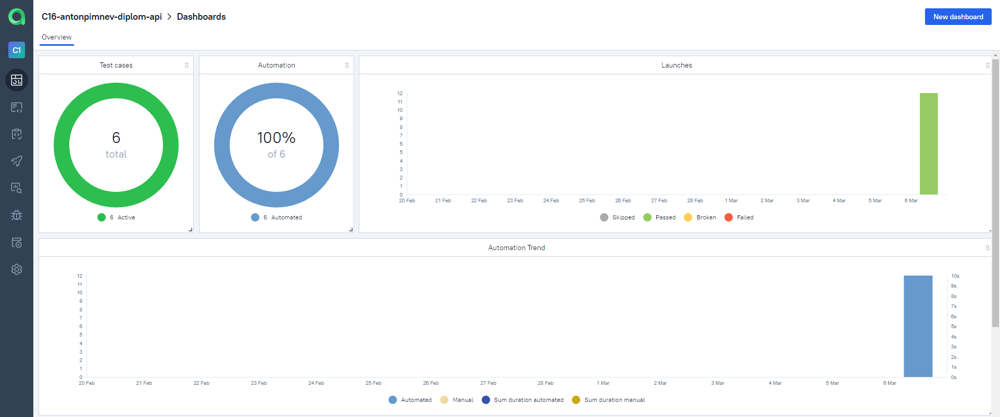
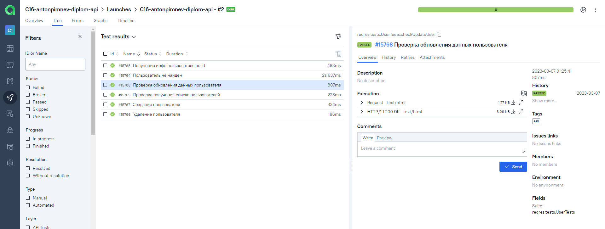
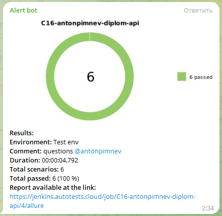

<a name="logo"></a>
## Учебный проект по автоматизации тестирования (API)

### Веб сайт <a target="_blank" href="https://reqres.in/">reqres.in</a>

<p align="center">

</p>

## Содержание:

- <a href="#tools">Технологии и инструменты</a>
- <a href="#cases">Список проверок, реализованных в тестах</a>
- <a href="#launch">Запуск тестов (сборка в Jenkins)</a>
- <a href="#allure">Allure-отчет</a>
- <a href="#allure-testops">Интеграция с Allure TestOps</a>
- <a href="#telegram">Уведомление в Telegram о результатах запуска тестов</a>

<a id="tools"></a>
## Технологии и инструменты

<p align="center">
<a href="https://www.jetbrains.com/idea/"></a>
<a href="https://www.java.com/"></a>
<a href="https://github.com/"></a>
<a href="https://junit.org/junit5/"></a>
<a href="https://gradle.org/"></a>
<a href="https://rest-assured.io/"></a>
<a href="https://aerokube.com/selenoid/"></a>
<a href="https://github.com/allure-framework/allure2"></a>
<a href="https://qameta.io/"></a>
<a href="https://www.jenkins.io/"></a>
</p>

<a id="cases"></a>
## Список проверок, реализованных в автотестах

- [x] Создание пользователя
- [x] Получение инфо пользователя по id
- [x] Проверка обновления данных пользователя
- [x] Удаление пользователя
- [x] Проверка получения списка пользователей
- [x] Проверка что пользователь не найден

<a id="launch"></a>
## Запуск тестов

###  Локальный запуск :
1. Запуск с командной строки:
```bash
gradle clean test
```
> Для запуска тестов в несколько потоков необходимо добавить параметр <code>-Dthreads={Количество потоков}</code>
>
> Например: <code>gradle clean test -Dthreads=2</code>
2. Получение отчёта:
```bash
gradle allureServe
```

###  Удаленный запуск (в Jenkins):
1. Открыть <a target="_blank" href="https://jenkins.autotests.cloud/job/C16-antonpimnev-diplom-api/">проект</a>


2. Нажать **Собрать сейчас**
3. Результат запуска сборки можно посмотреть в отчёте Allure

<a id="allure"></a>
## </a> Отчет в <a target="_blank" href="https://jenkins.autotests.cloud/job/C16-antonpimnev-diplom-api/3/allure/">Allure report</a>

###  Главная

<p align="center">

</p>

###  Тесты

<p align="center">

</p>

###  Графики

<p align="center">

</p>

<a id="allure-testops"></a>
## </a> Интеграция с <a target="_blank" href="https://allure.autotests.cloud/project/1981/dashboards">Allure TestOps</a>
### Cписок всех тест кейсов
<p align="center">

</p>

### Dashboard с результатами тестирования
<p align="center">

</p>

### Пример отчёта выполнения одного из автотестов
<p align="center">

</p>

<a id="telegram"></a>
## </a> Уведомление в Telegram о результатах запуска тестов

<p align="center">

</p>

[Вернуться к оглавлению ⬆](#logo)
